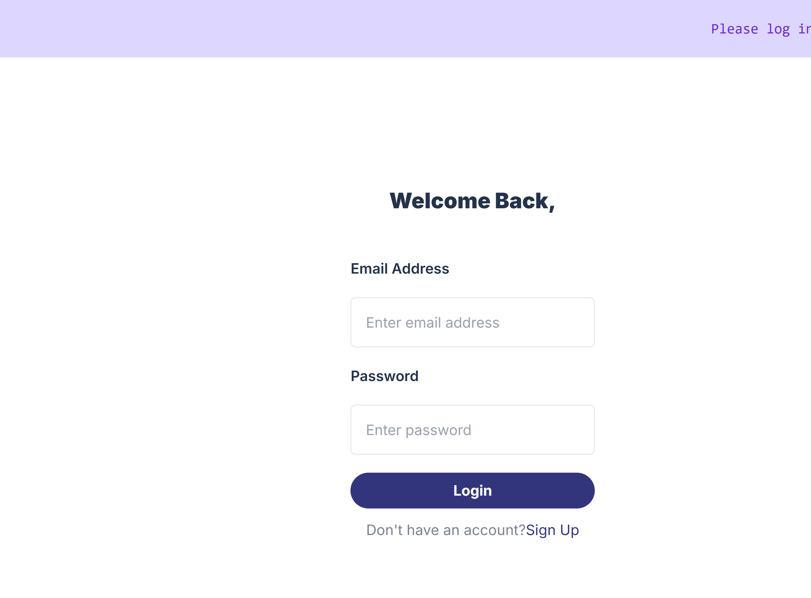
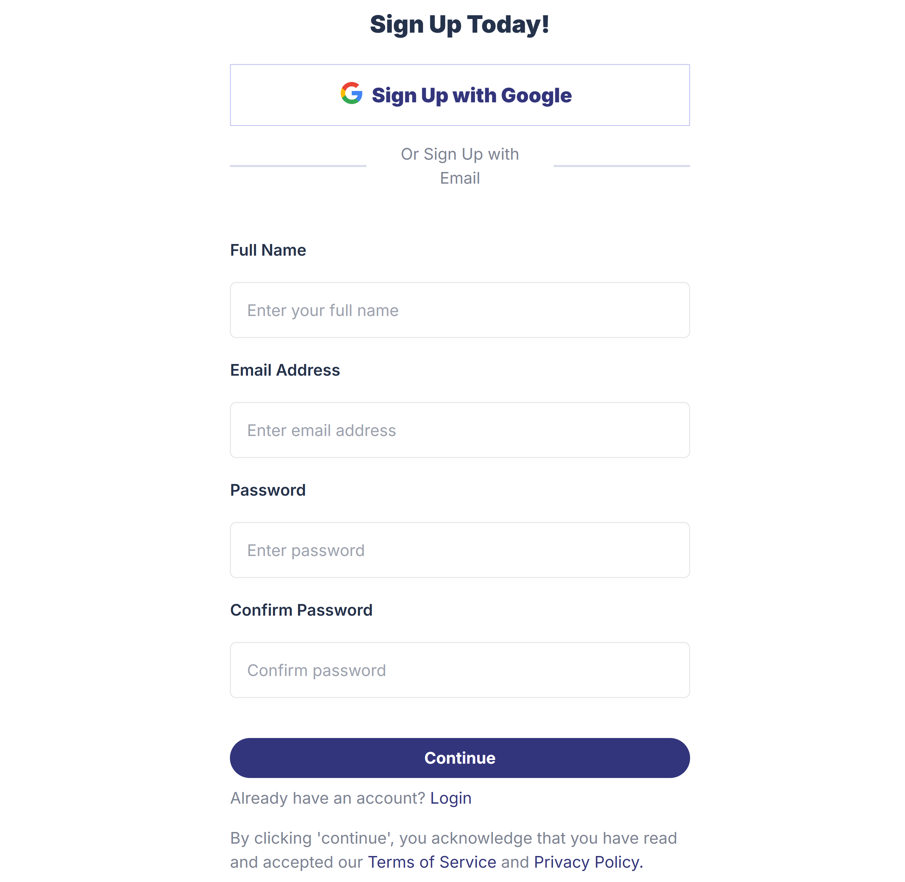
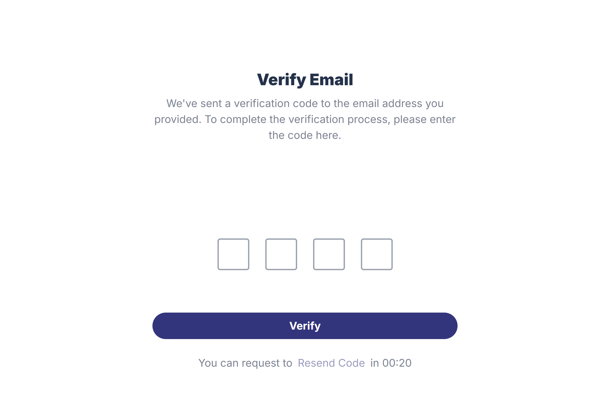
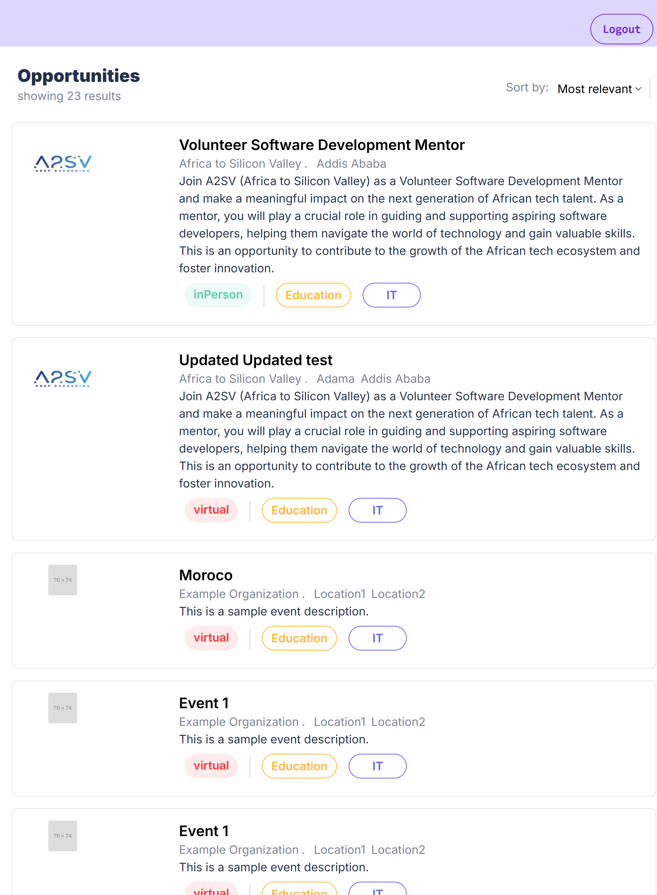

# Job Listing Application with Authentication

This project is a job listing application built with React and Next.js. It demonstrates the ability to create dynamic user interfaces, handle static data, and implement responsive designs using Tailwind CSS. The application features a job listing dashboard, job detail views, and various UI components such as job cards populated with dummy data.

## Features

- **Authentication**: User authentication functionality to secure access to the application and protect sensitive data.
- **Job Card Component:** A React component that closely resembles the design provided in the task.
- **Job Listing Dashboard:** A dashboard that lists all available job opportunities, styled using Tailwind CSS.
- **Job Details Page:** Detailed view of each job, including description, responsibilities, and other relevant information.

## Installation

To get started with this project, follow the steps below:

1. **Clone the repository:**

   ```bash
   git clone https://github.com/Rediet-W/Joblisting_app_with_authentication.git
    Navigate to the project directory:

    cd Joblisting_app_with_authentication
    Install dependencies:

    npm install
    Start the development server:

    npm run dev
    Open your browser and go to http://localhost:3000 to view the application.
   ```

## Screenshots

Unauthenticated users

signup page including the google signin

verification page

authorized user page with logout button on the navigation

